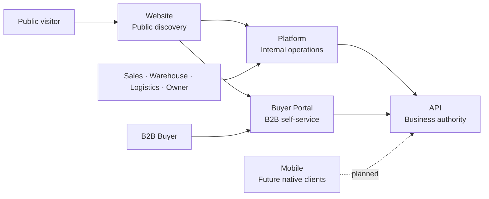

<div align="center">


# Nexa API

Business and integration API for Nexa Suite, implemented as a Spring Boot modular monolith.

[](https://dev.java/) [](https://spring.io/projects/spring-boot) [](https://maven.apache.org/) [](./docs/architecture/) [](https://github.com/nexa-suite/api/releases/latest)

[Latest Release](https://github.com/nexa-suite/api/releases/latest) · [Changelog](./CHANGELOG.md) · [Contributing](./.github/CONTRIBUTING.md) · [Security](./.github/SECURITY.md)

**Current repository:** API

[Website](https://github.com/nexa-suite/website) · [Platform](https://github.com/nexa-suite/platform) · [Portal](https://github.com/nexa-suite/portal) · [API](https://github.com/nexa-suite/api) · [Mobile](https://github.com/nexa-suite/mobile)

</div>

---

## Overview

Nexa API is the future authority for Nexa business and integration contracts. It is a modular monolith with explicit bounded-context boundaries and a pure Catalog Management domain foundation.

## Role in the Nexa Ecosystem

API serves independent clients through approved HTTP contracts. v0.3.0 establishes Catalog Management domain rules and a seed anticorruption layer without adding a catalog REST endpoint.

## Nexa Suite Architecture



## Repository Map

<table>
  <tr>
    <td width="50%"><h3>Website</h3><p>Public commercial discovery entry point.</p><p>Status: repository foundation target v0.1.0.</p><p><a href="https://github.com/nexa-suite/website">Repository</a></p></td>
    <td width="50%"><h3>Platform</h3><p>Internal operations for Sales, Warehouse, Logistics, Company Ownership and Administration.</p><p>Angular · v0.2.1 target.</p><p><a href="https://github.com/nexa-suite/platform">Repository</a></p></td>
  </tr>
  <tr>
    <td width="50%"><h3>Buyer Portal</h3><p>Buyer-facing catalog, requests, orders and delivery visibility.</p><p>Angular · v0.2.1 target.</p><p><a href="https://github.com/nexa-suite/portal">Repository</a></p></td>
    <td width="50%"><h3><b>API</b></h3><p>Business and integration authority.</p><p>Java 26 / Spring Boot 4.1 · v0.3.0 target.</p><p><a href="https://github.com/nexa-suite/api">Current repository</a></p></td>
  </tr>
  <tr>
    <td width="50%"><h3>Mobile</h3><p>Future native buyer and field-operation clients.</p><p>Status: planned · v0.1.0 target.</p><p><a href="https://github.com/nexa-suite/mobile">Repository</a></p></td>
    <td width="50%"></td>
  </tr>
</table>

## Scope

- Independent Spring Boot application and modular monolith.
- Correlation ID filter and safe Problem Details foundation.
- Pure Catalog Management aggregate, value objects and invariants.
- Anticorruption mapping from canonical seed records into domain objects.
- No catalog REST, persistence, authentication, authorization or tenant ownership behavior.

## Architecture

Each bounded context contains Presentation, Application, Domain and Infrastructure packages. Domain contains no framework or transport concerns. Catalog seed loading is infrastructure and is not a persistence entity.

## Bounded Contexts

| Area | Maturity |
|---|---|
| Catalog Management | Foundation in v0.3.0 |
| IAM | Planned |
| Tenant Management | Planned |
| Sales | Planned |
| Warehouse | Planned |
| Logistics | Planned |
| Invoicing | Planned |

## Tech Stack

Java 26, Spring Boot 4.1, Spring MVC, Bean Validation, Actuator, Spring Boot Test, Maven Wrapper and jar packaging.

## Getting Started

```bash
./mvnw clean test
./mvnw spring-boot:run
```

Open [http://localhost:8080/actuator/health](http://localhost:8080/actuator/health) and [http://localhost:8080/actuator/info](http://localhost:8080/actuator/info).

## Available Commands

```bash
./mvnw clean test
./mvnw clean package
./mvnw spring-boot:run
```

## Project Structure

```text
src/main/java/com/nexa/api/                  # Application and bounded contexts
src/main/java/com/nexa/api/shared/presentation # Correlation and Problem Details
src/main/java/com/nexa/api/catalogmanagement/infrastructure/seed # Seed authority
src/main/resources/seed/catalog/             # Byte-exact canonical seed and checksum
src/test/java/com/nexa/api/                  # HTTP and seed integrity tests
docs/releases/                               # Versioned release notes
```

## Documentation

- [Catalog Management domain](./docs/domain/catalog-management.md)
- [Client and automation compatibility](./docs/architecture/client-and-automation-compatibility.md)
- [ADR-003: Catalog domain foundation](./docs/architecture/decisions/ADR-003-catalog-domain-foundation.md)
- [Release policy](./.github/RELEASE_POLICY.md)

## Current Release

v0.3.0 adds pure Catalog Management domain rules, seed mapping and compatibility constraints. It adds no catalog REST endpoint and no persistence behavior.

## Roadmap

Future vertical slices require explicit contracts, identity, tenant isolation, persistence decisions and runtime evidence.
