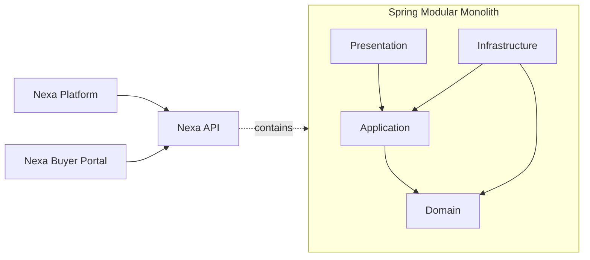

<div align="center">


# Nexa API

Shared Spring Boot modular monolith for Nexa Suite.

[](https://dev.java/)
[](https://spring.io/projects/spring-boot)
[](https://maven.apache.org/)
[](#architecture)
[](#architecture)
[](#current-status)

[Platform](https://github.com/nexa-suite/platform) · [Portal](https://github.com/nexa-suite/portal) · [API](https://github.com/nexa-suite/api)

</div>

---

## Overview

Nexa API is the shared backend authority being prepared for Nexa Suite business rules, contracts, security, tenant isolation, persistence and integrations.

## Role in the Nexa Ecosystem

API will serve both independent Angular applications through explicit HTTP contracts. This baseline exposes only Spring Boot Actuator information.



## Repository Map

| Repository | Responsibility | Technology |
|---|---|---|
| [Platform](https://github.com/nexa-suite/platform) | Internal operations for Sales, Warehouse, Logistics and Administration | Angular |
| [Portal](https://github.com/nexa-suite/portal) | Buyer-facing B2B experience | Angular |
| **API** — This repository | Business rules, contracts, security and persistence authority | Spring Boot |

## Scope

- Independent Spring Boot application.
- Modular monolith bounded-context structure.
- Explicit domain, application, infrastructure and presentation layers.
- Actuator health and info baseline.
- No business endpoints.

## Architecture

Each bounded context contains Presentation, Application, Domain and Infrastructure packages.

Presentation adapts HTTP. Application coordinates use cases and ports. Domain owns business rules. Infrastructure implements technical adapters.

## Bounded Contexts

- Shared.
- IAM.
- Tenant Management.
- Catalog Management.
- Sales.
- Warehouse.
- Logistics.
- Invoicing.

## Tech Stack

- Java 26.
- Spring Boot 4.1.
- Maven and Maven Wrapper.
- Spring Web MVC, Bean Validation, Actuator and Spring Boot Test.
- Jar packaging.

## Getting Started

```bash
./mvnw clean test
./mvnw spring-boot:run
```

Open [http://localhost:8080/actuator/health](http://localhost:8080/actuator/health).

## Available Commands

```bash
./mvnw clean package
./mvnw spring-boot:run
```

## Project Structure

```text
docs/assets/                 # Local Nexa documentation asset
src/main/java/com/nexa/api/ # Application and bounded contexts
src/main/resources/          # application.yml and local profile
src/test/java/com/nexa/api/  # Baseline context test
pom.xml                      # Spring Boot and dependency contract
```

## Current Status

This repository currently contains the approved architecture baseline.

Business capabilities, API integrations, persistence and security will be implemented incrementally through vertical slices.

## Out of Scope

- Authentication.
- Authorization.
- Persistence.
- PostgreSQL.
- Migrations.
- Business endpoints.
- Frontend integration.
- Deployment.

## Roadmap

1. Architecture baseline.
2. First approved vertical slice.
3. Security and tenant isolation.
4. Persistence and contracts.
5. Progressive legacy parity.
