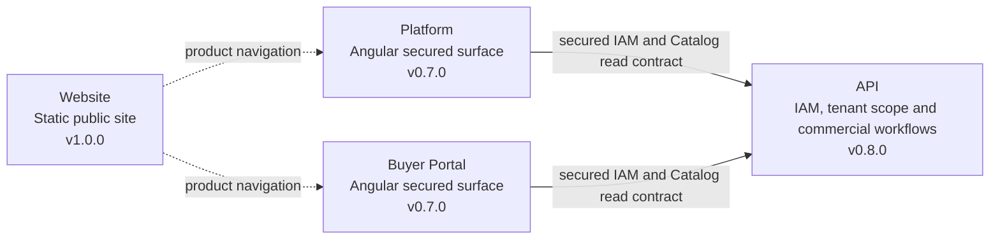

<div align="center">


# Nexa API

Business and integration API foundation for Nexa Suite, implemented as a Spring Boot modular monolith.

[](https://jdk.java.net/25/) [](https://spring.io/projects/spring-boot) [](https://maven.apache.org/) [](https://github.com/nexa-suite/api/releases/tag/v0.8.0)

[Changelog](./CHANGELOG.md) · [Release notes](./docs/releases/) · [Contributing](./.github/CONTRIBUTING.md) · [Security](./.github/SECURITY.md)

**Current repository:** API · **Latest published release:** `v0.8.0` · **Development version:** `0.9.0`

[Website](https://github.com/nexa-suite/website) · [Platform](https://github.com/nexa-suite/platform) · [Portal](https://github.com/nexa-suite/portal) · [API](https://github.com/nexa-suite/api) · [Mobile](https://github.com/nexa-suite/mobile)

</div>

---

## What is implemented

`v0.8.0` consolidates RS256 identity sessions, refresh-token rotation, tenant/workspace membership verification, Organization Administration, Client Accounts, Purchase Requests, Sales Orders, Warehouse, Logistics, dispatch and buyer delivery tracking over the existing checksum-validated catalog seed. It includes Flyway-managed PostgreSQL schemas, idempotency, optimistic concurrency, Problem Details and local OpenAPI.

Current `develop` artifact `0.9.0` also contains development contracts for Business Documents and evidence, invoice drafts, receivables and Stripe-compatible payment intents. Provider, fiscal and end-to-end publication gates remain separate; these development contracts do not establish a published release.

The API is the business authority for identity, workspace, Catalog, commercial, Warehouse and Logistics workflows. Published `v0.8.0` exposes Proof of Delivery metadata; current `develop` adds document, invoicing and payment contracts without claiming provider, fiscal or end-to-end completion.

Catalog routes require a valid RS256 access token, active membership and `catalog:read`. Health/info are public; local OpenAPI is enabled only with the `local` profile.

## Product boundaries



The diagram shows the approved secured vertical slice; it is not a public deployment claim. Mobile is not part of this runtime map: `mobile v0.1.1` is documentation-only. AI, IoT and cloud services remain future scope.


## Repository map

| Repository | Latest published release | Responsibility | Evidence status |
|---|---:|---|---|
| [Website](https://github.com/nexa-suite/website) | `v1.0.0` | Static public product discovery | Released static site |
| [Platform](https://github.com/nexa-suite/platform) | `v0.7.0` | Internal operations shell | Secured Angular commercial, Warehouse and Logistics surface |
| [Portal](https://github.com/nexa-suite/portal) | `v0.7.0` | Buyer self-service shell | Secured Angular commercial and delivery surface |
| **API** | **`v0.8.0`** | Business and integration authority | IAM, tenant scope, commercial, Warehouse and Logistics workflows |
| [Mobile](https://github.com/nexa-suite/mobile) | `v0.1.1` | Future native clients | Documentation-only |

## Bounded contexts

| Area | Current maturity |
|---|---|
| Catalog Management | Secured read and pricing contract in `v0.8.0` |
| IAM | RS256 sessions and refresh rotation |
| Tenant Management | Workspace membership and surface policy |
| Sales | Client Accounts, Purchase Requests and Sales Orders in `v0.8.0` |
| Warehouse | Inventory, FEFO reservations and readiness in `v0.8.0` |
| Logistics | Dispatch, incidents, Proof of Delivery metadata and buyer tracking in `v0.8.0` |
| Documents, invoicing and payments | Development contracts in `0.9.0`; provider and fiscal completion not claimed |

## Architecture

Each future bounded context keeps Presentation, Application, Domain and Infrastructure separated. Domain code remains framework-free. Catalog seed loading is an Infrastructure concern and is not a persistence entity.

## Tech stack

Java 25, Spring Boot 4.1.0, Spring MVC, Spring Security resource server, JPA infrastructure, Flyway, PostgreSQL 18.4, Bean Validation, Actuator, Maven Wrapper and jar packaging.

## Runtime

The canonical dual runtime is [ops/compose/compose.yml](./ops/compose/compose.yml). The Modern API, Platform and Portal run with the `modern-postgres` service; `modern-api` connects to PostgreSQL and runs Flyway migrations against it. Legacy services remain isolated under the `legacy` profile and require local secrets.

## Getting started

```bash
./mvnw clean test
./mvnw spring-boot:run
```

The local application exposes the Spring Boot health and info endpoints at [http://localhost:8080/actuator/health](http://localhost:8080/actuator/health) and [http://localhost:8080/actuator/info](http://localhost:8080/actuator/info). Swagger/OpenAPI is configured only for the `local` profile. These checks do not imply a released public business API.

## Project structure

```text
src/main/java/com/nexa/api/                              # Application and bounded-context packages
src/main/java/com/nexa/api/shared/presentation/          # Correlation and Problem Details
src/main/java/com/nexa/api/catalogmanagement/            # Catalog domain and seed mapping
src/main/resources/seed/catalog/                         # Canonical seed and checksum
src/test/java/com/nexa/api/                              # HTTP, domain and seed-integrity tests
docs/assets/repository-map/                              # Local architecture map
docs/releases/                                           # Versioned release notes
```

## Documentation

- [Catalog Management domain](./docs/domain/catalog-management.md)
- [Client and automation compatibility](./docs/architecture/client-and-automation-compatibility.md)
- [ADR-003: Catalog domain foundation](./docs/architecture/decisions/ADR-003-catalog-domain-foundation.md)
- [ADR-004: Catalog query contract](./docs/architecture/decisions/ADR-004-catalog-query-contract.md)
- [ADR-005: Deny-by-default API security](./docs/architecture/decisions/ADR-005-deny-by-default-api-security.md)
- [ADR-006: Seed-only query runtime](./docs/architecture/decisions/ADR-006-seed-only-query-runtime.md)
- [Local OpenAPI instructions](./docs/openapi/README.md)
- [Authentication contract](./docs/security/authentication.md)
- [Authorization contract](./docs/security/authorization.md)
- [Release notes index](./docs/releases/)
- [Release policy](./.github/RELEASE_POLICY.md)

## Roadmap boundary

New vertical slices require an explicit contract, identity and tenant decision, persistence evidence and runtime validation. Catalog content remains shared local reference data; tenant-specific assortment, pricing and stock are not claimed.
