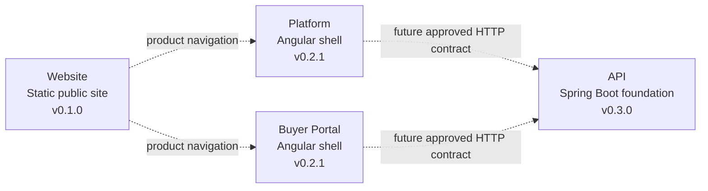
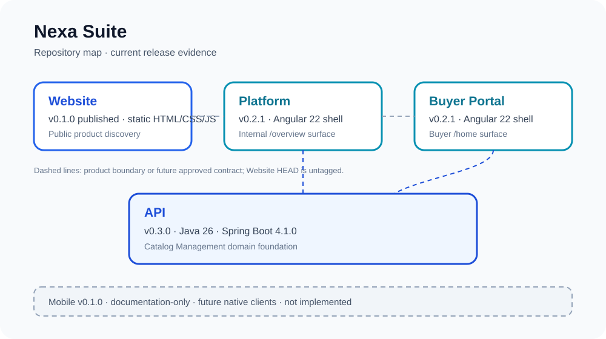

<div align="center">


# Nexa API

Business and integration API foundation for Nexa Suite, implemented as a Spring Boot modular monolith.

[](https://jdk.java.net/26/) [](https://spring.io/projects/spring-boot) [](https://maven.apache.org/) [](https://github.com/nexa-suite/api/releases/tag/v0.3.0)

[Changelog](./CHANGELOG.md) · [Release notes](./docs/releases/) · [Contributing](./.github/CONTRIBUTING.md) · [Security](./.github/SECURITY.md)

**Current repository:** API · **Current release:** `v0.3.0`

[Website](https://github.com/nexa-suite/website) · [Platform](https://github.com/nexa-suite/platform) · [Portal](https://github.com/nexa-suite/portal) · [API](https://github.com/nexa-suite/api) · [Mobile](https://github.com/nexa-suite/mobile)

</div>

---

## What is implemented

The tagged `v0.3.0` release establishes the Catalog Management domain foundation and a seed anticorruption mapping. It also includes correlation IDs, safe Problem Details handling and automated tests. The `v0.3.0` tag does not expose a catalog REST endpoint.

The API is the future business authority for approved client contracts. The tagged release is intentionally smaller than the complete Nexa domain: there is no persistence, tenant identity, multi-tenant authorization or external integration in this release.

The current worktree also contains untagged catalog query, security and OpenAPI changes under active development. They are not release evidence for `v0.3.0` until independently validated and tagged.

## Product boundaries



The diagram describes product boundaries, not a claim of deployed integration. Mobile is not part of this runtime map: `mobile v0.1.0` is documentation-only. PostgreSQL, AI, IoT and cloud services are not implemented in this repository release.



## Repository map

| Repository | Current release | Responsibility | Evidence status |
|---|---:|---|---|
| [Website](https://github.com/nexa-suite/website) | `v0.1.0` | Static public product discovery | Released static site |
| [Platform](https://github.com/nexa-suite/platform) | `v0.2.1` | Internal operations shell | Angular shell; integrations planned |
| [Portal](https://github.com/nexa-suite/portal) | `v0.2.1` | Buyer self-service shell | Angular shell; integrations planned |
| **API** | **`v0.3.0`** | Business and integration authority | Catalog domain foundation |
| [Mobile](https://github.com/nexa-suite/mobile) | `v0.1.0` | Future native clients | Documentation-only |

## Bounded contexts

| Area | Current maturity |
|---|---|
| Catalog Management | Domain foundation in `v0.3.0` |
| IAM | Planned |
| Tenant Management | Planned |
| Sales | Planned |
| Warehouse | Planned |
| Logistics | Planned |
| Invoicing | Planned |

## Architecture

Each future bounded context keeps Presentation, Application, Domain and Infrastructure separated. Domain code remains framework-free. Catalog seed loading is an Infrastructure concern and is not a persistence entity.

## Tech stack

Java 26, Spring Boot 4.1.0, Spring MVC, Bean Validation, Actuator, Spring Boot Test, Maven Wrapper and jar packaging.

## Getting started

```bash
./mvnw clean test
./mvnw spring-boot:run
```

The local application exposes the Spring Boot health and info endpoints at [http://localhost:8080/actuator/health](http://localhost:8080/actuator/health) and [http://localhost:8080/actuator/info](http://localhost:8080/actuator/info). Swagger/OpenAPI is configured only for the `local` profile. These checks do not imply a released public business API.

## Project structure

```text
src/main/java/com/nexa/api/                              # Application and bounded-context packages
src/main/java/com/nexa/api/shared/presentation/          # Correlation and Problem Details
src/main/java/com/nexa/api/catalogmanagement/            # Catalog domain and seed mapping
src/main/resources/seed/catalog/                         # Canonical seed and checksum
src/test/java/com/nexa/api/                              # HTTP, domain and seed-integrity tests
docs/assets/repository-map/                              # Local architecture map
docs/releases/                                           # Versioned release notes
```

## Documentation

- [Catalog Management domain](./docs/domain/catalog-management.md)
- [Client and automation compatibility](./docs/architecture/client-and-automation-compatibility.md)
- [ADR-003: Catalog domain foundation](./docs/architecture/decisions/ADR-003-catalog-domain-foundation.md)
- [Local OpenAPI instructions](./docs/openapi/README.md)
- [Release notes index](./docs/releases/)
- [Release policy](./.github/RELEASE_POLICY.md)

## Roadmap boundary

New vertical slices require an explicit contract, identity and tenant decision, persistence evidence and runtime validation. Documentation must keep planned PostgreSQL, AI, IoT, cloud and mobile work separate from the current implementation.
