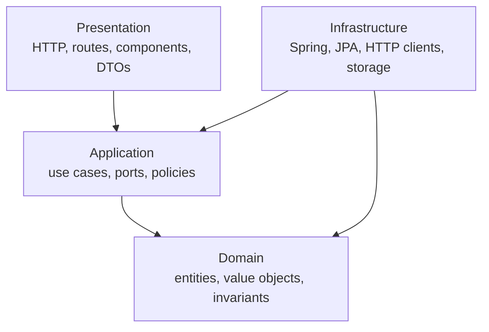

# Logical layering inside applications

Status: Accepted for TASK-NEXA-005.

Deployment tiers and internal code layers describe different boundaries. Inside the API and each Angular application, dependencies follow Presentation, Application, Domain and Infrastructure responsibilities.

Presentation translates transport concerns. Application coordinates use cases and depends on abstractions. Domain remains framework-free. Infrastructure implements ports and adapters; JPA entities and Spring Security types stay outside Domain. No layer may turn deployment-tier boundaries into direct browser-to-database access.
