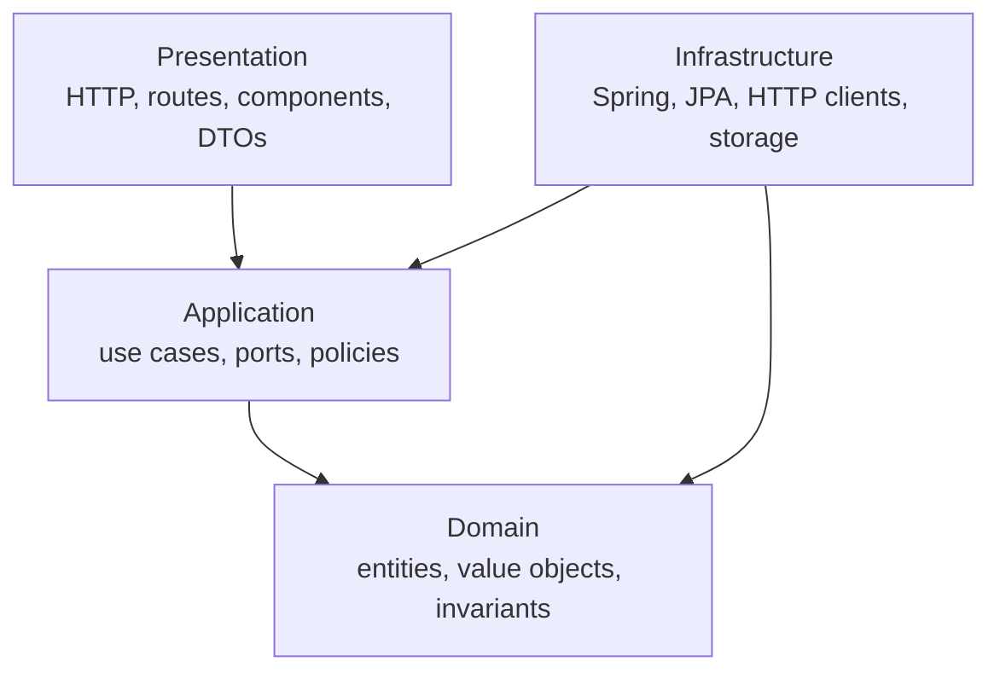

# Logical layering inside applications

Status: Accepted for TASK-NEXA-005.

Deployment tiers and internal code layers describe different boundaries. Inside the API and each Angular application, dependencies follow Presentation, Application, Domain and Infrastructure responsibilities.

```mermaid
flowchart TB
    Presentation["Presentation<br/>HTTP, routes, components, DTOs"]
    Application["Application<br/>use cases, ports, policies"]
    Domain["Domain<br/>entities, value objects, invariants"]
    Infrastructure["Infrastructure<br/>Spring, JPA, HTTP clients, storage"]
    Presentation --> Application
    Application --> Domain
    Infrastructure --> Application
    Infrastructure --> Domain
```

Presentation translates transport concerns. Application coordinates use cases and depends on abstractions. Domain remains framework-free. Infrastructure implements ports and adapters; JPA entities and Spring Security types stay outside Domain. No layer may turn deployment-tier boundaries into direct browser-to-database access.

For v0.19, persistence ownership is an additional constraint across the eleven
business contexts: infrastructure issues SQL only for tables assigned to its
context in [`canonical-sql-ownership.tsv`](canonical-sql-ownership.tsv).
Cross-context facts pass through narrow public contracts and immutable values
or existing typed errors. Runtime boundary adapters compose these contracts only; they
contain no business-table SQL. Existing local fixture seeding remains separate. The composition layer does not grant persistence
authority to a consumer or change the Presentation/Application/Domain/Infrastructure
dependency direction shown above.
