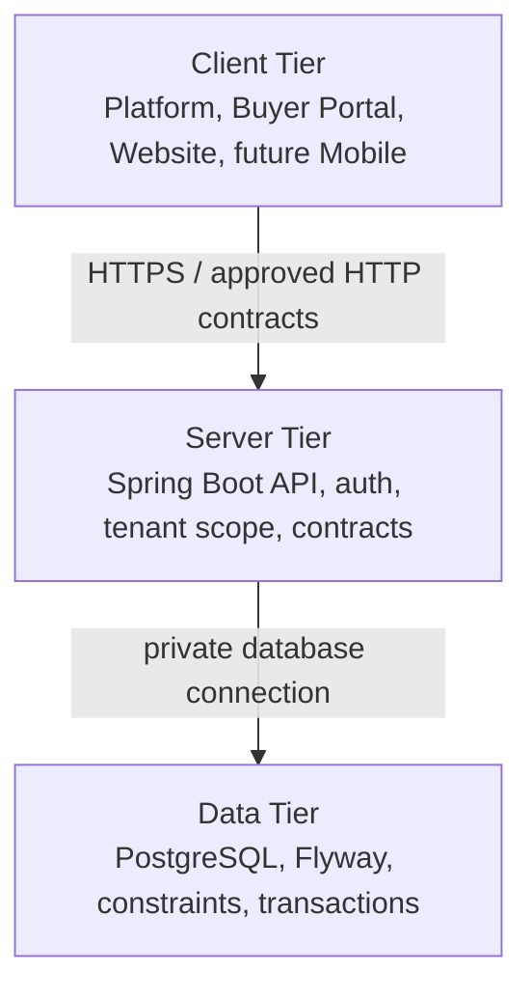

# Three-tier deployment architecture

Status: Accepted for TASK-NEXA-005.

Nexa keeps deployment boundaries explicit. Browser clients belong to Client Tier, Spring Boot owns security and business authority in Server Tier, and PostgreSQL remains private Data Tier.

Client code renders, assists input and navigates. It is not a security authority and never receives database credentials or connects to PostgreSQL. Server code validates authentication, authorization, workspace membership and transactions. Data code enforces durable identity, tenancy and relational constraints.

Modern Docker networks reflect this boundary: `nexa-modern-edge` carries client-to-API traffic; `nexa-modern-data` is internal and carries API-to-PostgreSQL traffic only.
